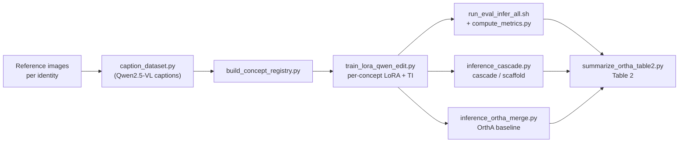

# LILAC: Layer-wise Identity LoRA Cascade for Multi-Concept Generation

LILAC composes **multiple specific identities** into a single image on the
[Qwen-Image-Edit](https://huggingface.co/Qwen/Qwen-Image-Edit) backbone, without
concept entanglement. Each identity is captured by its own LoRA adapter, and the
adapters are applied **one per pass** in a cascade (or scaffold) so that each
subject is bound to its own region — instead of being summed into a single
merged model, which collapses identities on diffusion-transformer backbones.

This repository contains the full code and reference dataset to reproduce the
single-concept and multi-concept (cascade / scaffold) results, as well as the
**OrthA** (Orthogonal Adaptation) same-backbone baseline.

> Anonymous code release for double-blind review. See [`NOTICE`](NOTICE).

---

## Method overview

A LoRA + textual-inversion adapter is trained per identity on a handful of
reference images. At inference, multiple concepts are combined with one of two
sequential strategies:

- **Cascade** — pass 1 generates the anchor subject on a blank canvas with only
  its LoRA active; each subsequent pass conditions on the frozen previous output
  and activates only the next concept's LoRA, adding one subject at a time.
- **Scaffold** — a layout scaffold is initialized, then each concept's LoRA edits
  its assigned region left-to-right.

Because exactly **one LoRA is active per pass**, identities never blend. The
baseline **OrthA** instead trains LoRAs in mutually orthogonal column subspaces
and *sums* their weight deltas for a single forward pass.



---

## Key results

Multi-concept composition over 8 identities (24 triples × 3 scenes). Metrics:
**TA** = text alignment (CLIPScore), **IA** = image alignment (CLIP on face
crops), **ID** = identity preservation (ArcFace detection rate @ 0.68).

| Method                         | TA    | IA    | ID    |
|--------------------------------|:-----:|:-----:|:-----:|
| Single-concept (reference, S)  | 0.750 | 0.750 | 0.929 |
| **LILAC Cascade** (M)          | 0.777 | 0.784 | **0.708** |
| OrthA — same backbone (M)      | 0.664 | 0.869 | **0.000** |

Averages are computed over **all 24 triples** (unfiltered). On a best-of-seed
basis with quality gates, LILAC Cascade keeps 17/24 triples at **ID = 1.000**.

The decisive signal is **ID**: OrthA produces visually plausible faces (high IA
under CLIP) but **0.000 identity preservation** — ArcFace verifies none of the
merged subjects. Summing orthogonal LoRAs does not preserve identity on a
global-attention diffusion-transformer backbone, whereas LILAC's one-LoRA-per-
pass cascade does.

---

## Repository structure

```
LILAC/
├── README.md
├── NOTICE
├── requirements.txt
├── concept_map.tsv            # authoritative concept → dataset mapping
├── configs/
│   └── default.yaml           # reference hyperparameters
├── scripts/
│   ├── caption_dataset.py            # Qwen2.5-VL / BLIP-2 captioning
│   ├── make_concept_map.py           # scaffold a concept_map.tsv template
│   ├── build_concept_registry.py     # concept_map + datasets → registry
│   ├── train_lora_qwen_edit.py       # per-concept LoRA (+TI, +OrthA mode)
│   ├── inference_lora.py             # single-concept inference
│   ├── inference_cascade.py          # multi-concept cascade / scaffold (LILAC)
│   ├── inference_ortha_merge.py      # OrthA merged-LoRA baseline
│   ├── compute_metrics.py            # single-concept TA / IA / ID
│   ├── compute_metrics_multi.py      # multi-concept TA / IA / ID
│   ├── summarize_ortha_table2.py     # Table 2 (S→M deltas)
│   ├── ortha_sanity_check.py         # numerical OrthA invariants
│   ├── setup_env.sh                  # environment installer
│   ├── run_recaption_all.sh          # caption all datasets
│   ├── run_train_all.sh              # train all standard LoRAs
│   ├── run_train_ortha_all.sh        # train all orthogonal LoRAs
│   ├── run_eval_infer_all.sh         # single-concept eval inference
│   ├── run_multi_concept_all.sh      # cascade / scaffold inference
│   ├── run_ortha_qwen_experiment.sh  # full OrthA experiment
│   └── run_ortha_table2.sh           # full Table 2 pipeline
└── Datasets/
    └── S1 .. S21/             # reference images (+ metadata.jsonl)
```

---

## Installation

```bash
bash scripts/setup_env.sh            # creates ./venv and installs everything
# or into the current interpreter:
bash scripts/setup_env.sh --no-venv
# or plain pip:
pip install -r requirements.txt
```

Requires a CUDA GPU for training/inference (≈40 GB for LoRA training at 512px).
The `setup_env.sh` script also runs a verification pass that imports
`QwenImageEditPipeline` and checks the eval stack (CLIP, ArcFace).

---

## Dataset

`Datasets/` holds the reference images, one directory per concept:

```
Datasets/S1/
├── 1.png, 2.png, ...          # 10–18 reference images of the identity
└── metadata.jsonl             # captions + trigger token (created by captioning)
```

The mapping from directory to concept name / type / trigger token lives in
[`concept_map.tsv`](concept_map.tsv) (tab-separated, treated as authoritative):

```
# dataset	concept	type	trigger_token	has_images
Datasets/S1	trump	man	ohwx	17
Datasets/S2	pope	man	ohwx	17
...
```

Because the images total ~1.8 GB, the dataset is tracked with **Git LFS**:

```bash
git lfs install
git clone <repo-url>            # pulls images via LFS
```

---

## Usage (end-to-end)

The pipeline is split into composable steps. All multi-GPU runners accept
`NGPU=<n>` and `GPUS="<ids>"` (e.g. `GPUS="3 4 5 6 7"`) to pin specific devices,
and `CONCEPTS="a b c"` to restrict the concept set.

**1. Caption the datasets** (writes `metadata.jsonl` per concept):

```bash
python scripts/caption_dataset.py \
    --dataset_dir Datasets/S1 --concept_name trump --class_noun man
# or all at once:
bash scripts/run_recaption_all.sh
```

**2. Build the concept registry:**

```bash
python scripts/build_concept_registry.py \
    --concept_map concept_map.tsv --output concept_registry.json
```

**3. Train per-concept LoRA + textual inversion:**

```bash
CONCEPTS="thor hulk thanos lebron pope trump messi gosling" NGPU=8 \
    bash scripts/run_train_all.sh
```

**4. Single-concept evaluation (reference S baseline):**

```bash
CONCEPTS="thor hulk thanos lebron pope trump messi gosling" NGPU=8 \
    bash scripts/run_eval_infer_all.sh
python scripts/compute_metrics.py \
    --eval_dir outputs/eval_infer --registry concept_registry.json --datasets_dir Datasets
```

**5. Multi-concept LILAC (cascade and scaffold):**

```bash
NGPU=8 MODE=cascade  bash scripts/run_multi_concept_all.sh
NGPU=8 MODE=scaffold SCAFFOLD_INIT=ref_strip bash scripts/run_multi_concept_all.sh

python scripts/compute_metrics_multi.py \
    --multi_dir outputs/multi_concept/cascade  --registry concept_registry.json --datasets_dir Datasets
python scripts/compute_metrics_multi.py \
    --multi_dir outputs/multi_concept/scaffold --registry concept_registry.json --datasets_dir Datasets
```

**6. OrthA baseline (train orthogonal LoRAs → merge → metrics):**

```bash
CONCEPTS="thor hulk thanos lebron pope trump messi gosling" NGPU=8 \
    bash scripts/run_ortha_qwen_experiment.sh
```

**7. Table 2 summary:**

```bash
python scripts/summarize_ortha_table2.py \
    --single_metrics outputs/eval_infer/metrics.json \
    --multi_root outputs/multi_concept \
    --methods ortha,cascade,scaffold
```

---

## Key hyperparameters

| Parameter            | Default | Description                              |
|----------------------|:-------:|------------------------------------------|
| `--rank`             | 64      | LoRA rank                                |
| `--lora_alpha`       | 128     | LoRA scaling (2× rank, the "a2x" recipe) |
| `--learning_rate`    | 1e-4    | LoRA learning rate                       |
| `--ti_learning_rate` | 5e-4    | Textual-inversion learning rate          |
| `--max_train_steps`  | 1500    | Training iterations per concept          |
| `--source_dropout`   | 1.0     | Blank-source training (text-only identity) |
| `--lora_scale`       | 1.0     | LoRA strength at inference               |
| `num_inference_steps`| 30      | Diffusion steps at eval                  |
| `cfg_scale`          | 4.0     | Classifier-free guidance                 |

LoRA targets the MMDiT attention projections (`to_q/k/v`, `to_out.0`,
`add_q/k/v_proj`, `to_add_out`). Training uses a blank source image so identity
is learned purely from the trigger token, leaving the source channel free for a
scene at inference.

---

## Evaluation metrics

- **TA — Text Alignment:** CLIPScore between the generated image and the
  generation prompt.
- **IA — Image Alignment:** CLIP cosine similarity between per-subject face crops
  and the concept's reference images.
- **ID — Identity:** ArcFace (InsightFace `buffalo_l`) detection rate at cosine
  threshold 0.68; reported per concept and averaged.

Multi-concept scoring supports best-of-seed selection with configurable quality
gates (`--min_id`, `--min_per_concept_id`, `--min_ia`, `--min_ta`).

---

## Acknowledgements

This work builds on the following open releases:

- [Qwen-Image / Qwen-Image-Edit](https://github.com/QwenLM/Qwen-Image) — base
  generation and editing backbone.
- [Qwen-Image-Layered](https://github.com/QwenLM/Qwen-Image) — layer
  decomposition (referenced for the layered formulation).
- **OrthA**: Po et al., *Orthogonal Adaptation for Modular Customization of
  Diffusion Models*, CVPR 2024 — the same-backbone baseline.

The base models, layered decomposition model, and captioner are downloaded from
the Hugging Face Hub at runtime and are **not** included in this repository.

---

## Citation

```bibtex
@misc{lilac_anonymous,
  title  = {LILAC: Layer-wise Identity LoRA Cascade for Multi-Concept Generation},
  author = {Anonymous},
  year   = {2026},
  note   = {Under review}
}
```

---

## Notice

Code released for research and reproducibility purposes. See [`NOTICE`](NOTICE).
