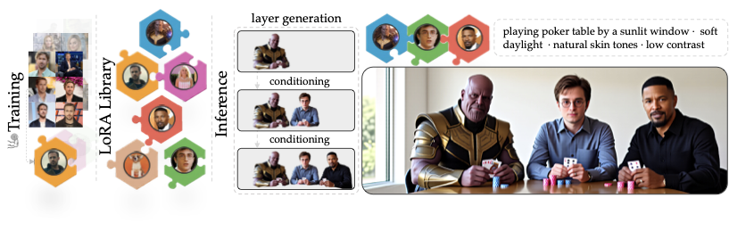
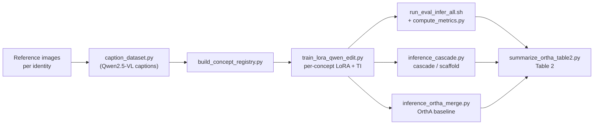
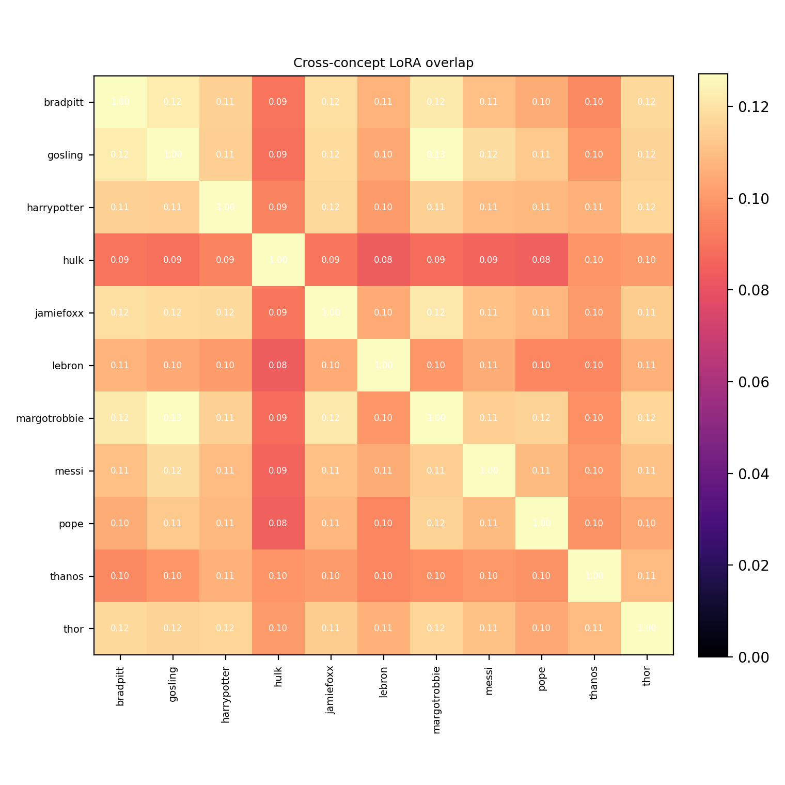
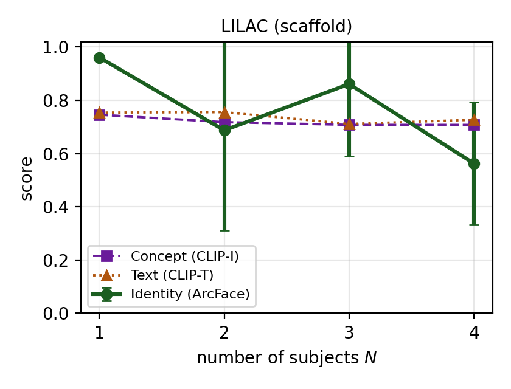

# LILAC: Layer-Wise Independent LoRAs and Cascaded Conditioning for Multi-Concept Customization of Diffusion Models

LILAC composes **multiple specific subjects** into a single coherent image by
treating multi-subject generation as a **layered synthesis** problem rather than
a weight-merging one. Each concept is captured by an independently trained LoRA
adapter, and subjects are composed at inference time with **exactly one adapter
active per pass**, each pass conditioned on the frozen composite of the subjects
already placed. Because no two adapters are ever active together, cross-concept
interference is eliminated at the parameter level *by construction* — no joint
training, no per-composition optimization, and no weight merging.

LILAC is backbone-agnostic. This repository instantiates it on
[Qwen-Image-Edit](https://huggingface.co/Qwen/Qwen-Image-Edit) (with two
configurations, **scaffold** and **decomposition**) and reproduces the
single-concept and multi-concept results, as well as the **OrthA** (Orthogonal
Adaptation) same-backbone baseline.

> Anonymous code release for double-blind review. See [`NOTICE`](NOTICE).



*Overview.* **Training** (left): each concept is trained in isolation into a
single LoRA adapter, building a library of independently trained per-subject
adapters. **LoRA Library** (center): one adapter per subject. **Inference**
(right): LILAC selects a subset and renders every subject in one coherent scene
from a text prompt — exactly one adapter is active per pass under frozen
conditioning, so identities never interfere at the parameter level (no joint
training, no weight merging).

---

## Method overview

A LoRA (+ textual-inversion) adapter is trained per identity on a handful of
reference images, fully in isolation — no shared basis, no orthogonality
constraint. At inference, subjects are composed sequentially. On a native layered
backbone each subject is rendered directly on its own RGBA layer; on a standard
image backbone (Qwen-Image-Edit) the same cascade is realized in one of two
configurations:

- **Scaffold** (default) — the first pass renders a complete scene with generic
  placeholder figures in the intended arrangement; each concept pass then
  *replaces* one placeholder via an image-editing pass that takes the frozen
  scene as context and activates only that concept's adapter.
- **Decomposition** — a generated/natural scene is split into RGBA layers by
  Qwen-Image-Layered; each person layer is re-rendered with its concept adapter
  and alpha-composited back. This inherits any error in the layer split, so it
  preserves identity less reliably than scaffold.

Because exactly **one adapter is active per pass**, the cross-concept crosstalk
χ_ij = ‖ΔWᵢᵀΔWⱼ‖_F is never instantiated. Independently trained adapters are in
fact *not* orthogonal (mean pairwise residual overlap 0.106, 5.3× the 0.020
chance level), so weight-merging methods must actively suppress χ_ij; LILAC
removes it structurally. The baseline **OrthA** instead trains LoRAs in mutually
orthogonal column subspaces and *sums* their weight deltas for a single forward
pass.




*Scaffold configuration.* Given an image (natural or generated), each concept is
added in its own pass with only its adapter active, conditioned on the frozen
image of the concepts placed so far. No two adapters are active together; earlier
concepts and the background are preserved as later ones are added. The final pass
adds a non-person concept (sunglasses), showing the procedure composes objects
and attributes as well as identities.


*Decomposition configuration.* The input image is split into RGBA layers (a
background and subject layers); each subject is regenerated in its own pass with
its adapter active, then recombined. Because the per-subject layers come from a
layer split rather than a direct edit, this route inherits any error in the split
and preserves identity less reliably than scaffold.

---

## Key results

Multi-subject comparison on the Orthogonal Adaptation concept bank and protocol.
For each metric we report the single-concept score (**Single**), the
multi-concept score (**Multi**), and their difference (**Δ**). For weight-merging
baselines, Multi is the post-merge result and Δ is the merge-induced change;
LILAC performs no weight merging (merge time *none*), so its Δ is the
single-to-multi composition gap. Metrics: **Text** = CLIPScore vs. joint prompt,
**Image** = CLIP-I on per-subject crops, **Identity** = ArcFace detection rate
(cosine > 0.32). Higher is better.

| Method | Merge time | Text S | Text M | ΔText | Image S | Image M | ΔImg | ID S | ID M | ΔID |
|---|:--:|:--:|:--:|:--:|:--:|:--:|:--:|:--:|:--:|:--:|
| P+ | <1 s | 0.643 | 0.643 | — | 0.683 | 0.683 | — | 0.515 | 0.515 | — |
| Custom Diffusion | ~2 s | 0.668 | 0.673 | +0.005 | 0.648 | 0.623 | −0.025 | 0.504 | 0.408 | −0.096 |
| DB-LoRA (FedAvg) | <1 s | 0.613 | 0.682 | +0.069 | 0.744 | 0.531 | −0.213 | 0.683 | 0.098 | −0.585 |
| Mix-of-Show (FedAvg) | <1 s | 0.625 | 0.621 | −0.004 | 0.745 | 0.735 | −0.010 | 0.728 | 0.706 | −0.022 |
| Mix-of-Show (Grad. Fusion) | ~15 m | 0.625 | 0.631 | +0.006 | 0.745 | 0.729 | −0.016 | 0.728 | 0.717 | −0.011 |
| Orthogonal Adaptation (SDXL) | <1 s | 0.624 | 0.644 | −0.010 | 0.748 | 0.741 | −0.007 | 0.740 | 0.745 | +0.005 |
| Orthogonal Adaptation (Qwen, same backbone) | <1 s | 0.750 | 0.664 | −0.086 | 0.750 | **0.869** | +0.119 | 0.929 | 0.000 | −0.929 |
| **LILAC (decomposition)** | none | 0.754 | **0.734** | −0.020 | 0.746 | 0.743 | −0.003 | 0.961 | 0.639 | −0.322 |
| **LILAC (scaffold)** | none | 0.754 | 0.711 | −0.043 | 0.746 | 0.738 | −0.008 | 0.961 | **0.861** | −0.100 |
| **LILAC (LaDe, native layered)** | none | 0.759 | **0.758** | −0.001 | 0.761 | **0.745** | −0.016 | 0.879 | **0.877** | −0.002 |

Top-block baseline numbers are quoted from the SDXL results of Orthogonal
Adaptation; absolute values are comparable in scale but indicative across
backbones. LILAC reaches the two highest identity scores in the table
(**0.861** scaffold, **0.877** native layered) and, on the layered backbone,
stays essentially flat from single to multi (ΔID −0.002): adding a subject adds
a pass, not a cross term.

**Same-backbone control.** Run on Qwen-Image-Edit — the backbone LILAC uses —
Orthogonal Adaptation collapses at three subjects to an ArcFace detection rate of
**0.000** (ΔID −0.929), versus **0.861** for LILAC scaffold. The failure is
specific to identity: image alignment even *rises* (IA 0.869). The orthogonal
increments act jointly over the full transformer token sequence rather than over
disjoint spatial regions, yielding plausible but blended faces — CLIP-based IA
still scores them as the right kind of person, while ArcFace rejects each as a
biometric match. This is the parameter-level interference LILAC removes by
construction, and it shows IA alone is misleading while identity exposes the
merge failure.


*Qualitative comparison.* Each pair of rows shows Orthogonal Adaptation (top) and
LILAC scaffold (bottom) on the same prompt. Groups vary in size and combine real
public figures, stylized fictional characters, animals, and accessories, placed
in diverse scene contexts. LILAC preserves each identity and keeps the subjects
distinct, with consistent lighting and plausible arrangement.

### Subject-ordering ablation

Eight fixed three-subject groups composed under three orderings (scaffold
configuration). The default orders subjects by descending LoRA Frobenius norm
‖ΔW‖_F (anchor first). All orderings fall within a narrow band, so the method is
largely robust to composition order; placing the strongest adapter first is a
sound default.

| Ordering | Identity | Image | Text |
|---|:--:|:--:|:--:|
| Random | **0.850** | **0.766** | 0.687 |
| Anchor-last (ascending) | 0.822 | 0.730 | 0.709 |
| Anchor-first (descending, ours) | **0.850** | 0.723 | **0.714** |

### Cross-concept overlap and scalability

<p align="center">
  
  
</p>

*Left — cross-concept overlap.* Each cell is the normalised overlap between the
LoRA residuals of two concepts (1 on the diagonal; 0 for orthogonal residuals).
Off-diagonal values average **0.106**, 5.3× the 0.020 chance level for random
adapters of the same size: independently trained adapters are *not* orthogonal.
This is the crosstalk χ_ij that weight-space fusion must suppress and that
per-layer binding never instantiates.

*Right — scalability.* Per-subject quality vs. the number of subjects N (scaffold).
Concept fidelity (CLIP-I) and text alignment (CLIP-T) stay flat as N grows, while
the ArcFace detection rate is lower and noisier at larger N — reflecting scene
crowding and smaller faces rather than identity blending, which the per-concept
binding removes by construction.

### Single-concept renderings under a strong style


*Stylized single-concept renderings* (Cyberpunk 2077 style) for three concepts:
input references (top) versus Orthogonal Adaptation and LILAC. A pronounced style
stresses identity preservation because the style competes with each subject's
appearance.

---

## Repository structure

```
LILAC/
├── README.md
├── NOTICE
├── requirements.txt
├── concept_map.tsv            # authoritative concept → dataset mapping
├── configs/
│   └── default.yaml           # reference hyperparameters
├── scripts/
│   ├── caption_dataset.py            # Qwen2.5-VL / BLIP-2 captioning
│   ├── make_concept_map.py           # scaffold a concept_map.tsv template
│   ├── build_concept_registry.py     # concept_map + datasets → registry
│   ├── train_lora_qwen_edit.py       # per-concept LoRA (+TI, +OrthA mode)
│   ├── inference_lora.py             # single-concept inference
│   ├── inference_cascade.py          # multi-concept cascade / scaffold (LILAC)
│   ├── inference_ortha_merge.py      # OrthA merged-LoRA baseline
│   ├── compute_metrics.py            # single-concept TA / IA / ID
│   ├── compute_metrics_multi.py      # multi-concept TA / IA / ID
│   ├── summarize_ortha_table2.py     # Table 2 (S→M deltas)
│   ├── ortha_sanity_check.py         # numerical OrthA invariants
│   ├── setup_env.sh                  # environment installer
│   ├── run_recaption_all.sh          # caption all datasets
│   ├── run_train_all.sh              # train all standard LoRAs
│   ├── run_train_ortha_all.sh        # train all orthogonal LoRAs
│   ├── run_eval_infer_all.sh         # single-concept eval inference
│   ├── run_multi_concept_all.sh      # cascade / scaffold inference
│   ├── run_ortha_qwen_experiment.sh  # full OrthA experiment
│   └── run_ortha_table2.sh           # full Table 2 pipeline
└── Datasets/
    └── S1 .. S21/             # reference images (+ metadata.jsonl)
```

---

## Installation

```bash
bash scripts/setup_env.sh            # creates ./venv and installs everything
# or into the current interpreter:
bash scripts/setup_env.sh --no-venv
# or plain pip:
pip install -r requirements.txt
```

Requires a CUDA GPU for training/inference (≈40 GB for LoRA training at 512px).
The `setup_env.sh` script also runs a verification pass that imports
`QwenImageEditPipeline` and checks the eval stack (CLIP, ArcFace).

---

## Dataset

`Datasets/` holds the reference images, one directory per concept:

```
Datasets/S1/
├── 1.png, 2.png, ...          # 10–18 reference images of the identity
└── metadata.jsonl             # captions + trigger token (created by captioning)
```

The mapping from directory to concept name / type / trigger token lives in
[`concept_map.tsv`](concept_map.tsv) (tab-separated, treated as authoritative):

```
# dataset	concept	type	trigger_token	has_images
Datasets/S1	trump	man	ohwx	17
Datasets/S2	pope	man	ohwx	17
...
```

Because the images total ~1.8 GB, the dataset is tracked with **Git LFS**:

```bash
git lfs install
git clone <repo-url>            # pulls images via LFS
```

---

## Usage (end-to-end)

The pipeline is split into composable steps. All multi-GPU runners accept
`NGPU=<n>` and `GPUS="<ids>"` (e.g. `GPUS="3 4 5 6 7"`) to pin specific devices,
and `CONCEPTS="a b c"` to restrict the concept set.

**1. Caption the datasets** (writes `metadata.jsonl` per concept):

```bash
python scripts/caption_dataset.py \
    --dataset_dir Datasets/S1 --concept_name trump --class_noun man
# or all at once:
bash scripts/run_recaption_all.sh
```

**2. Build the concept registry:**

```bash
python scripts/build_concept_registry.py \
    --concept_map concept_map.tsv --output concept_registry.json
```

**3. Train per-concept LoRA + textual inversion:**

```bash
CONCEPTS="thor hulk thanos lebron pope trump messi gosling" NGPU=8 \
    bash scripts/run_train_all.sh
```

**4. Single-concept evaluation (reference S baseline):**

```bash
CONCEPTS="thor hulk thanos lebron pope trump messi gosling" NGPU=8 \
    bash scripts/run_eval_infer_all.sh
python scripts/compute_metrics.py \
    --eval_dir outputs/eval_infer --registry concept_registry.json --datasets_dir Datasets
```

**5. Multi-concept LILAC (cascade and scaffold):**

```bash
NGPU=8 MODE=cascade  bash scripts/run_multi_concept_all.sh
NGPU=8 MODE=scaffold SCAFFOLD_INIT=ref_strip bash scripts/run_multi_concept_all.sh

python scripts/compute_metrics_multi.py \
    --multi_dir outputs/multi_concept/cascade  --registry concept_registry.json --datasets_dir Datasets
python scripts/compute_metrics_multi.py \
    --multi_dir outputs/multi_concept/scaffold --registry concept_registry.json --datasets_dir Datasets
```

**6. OrthA baseline (train orthogonal LoRAs → merge → metrics):**

```bash
CONCEPTS="thor hulk thanos lebron pope trump messi gosling" NGPU=8 \
    bash scripts/run_ortha_qwen_experiment.sh
```

**7. Table 2 summary:**

```bash
python scripts/summarize_ortha_table2.py \
    --single_metrics outputs/eval_infer/metrics.json \
    --multi_root outputs/multi_concept \
    --methods ortha,cascade,scaffold
```

---

## Key hyperparameters

| Parameter            | Default | Description                              |
|----------------------|:-------:|------------------------------------------|
| `--rank`             | 64      | LoRA rank                                |
| `--lora_alpha`       | 128     | LoRA scaling (2× rank, the "a2x" recipe) |
| `--learning_rate`    | 1e-4    | LoRA learning rate                       |
| `--ti_learning_rate` | 5e-4    | Textual-inversion learning rate          |
| `--max_train_steps`  | 1500    | Training iterations per concept          |
| `--source_dropout`   | 1.0     | Blank-source training (text-only identity) |
| `--lora_scale`       | 1.0     | LoRA strength at inference               |
| `num_inference_steps`| 30      | Diffusion steps at eval                  |
| `cfg_scale`          | 4.0     | Classifier-free guidance                 |

LoRA targets the MMDiT attention projections (`to_q/k/v`, `to_out.0`,
`add_q/k/v_proj`, `to_add_out`). Training uses a blank source image so identity
is learned purely from the trigger token, leaving the source channel free for a
scene at inference.

---

## Evaluation metrics

- **TA — Text Alignment:** CLIPScore between the generated image and the
  generation prompt.
- **IA — Image Alignment:** CLIP cosine similarity between per-subject face crops
  and the concept's reference images.
- **ID — Identity:** ArcFace (InsightFace `buffalo_l`) detection rate at cosine
  threshold 0.68; reported per concept and averaged.

Multi-concept scoring supports best-of-seed selection with configurable quality
gates (`--min_id`, `--min_per_concept_id`, `--min_ia`, `--min_ta`).

---

## Acknowledgements

This work builds on the following open releases:

- [Qwen-Image / Qwen-Image-Edit](https://github.com/QwenLM/Qwen-Image) — base
  generation and editing backbone.
- [Qwen-Image-Layered](https://github.com/QwenLM/Qwen-Image) — layer
  decomposition (referenced for the layered formulation).
- **OrthA**: Po et al., *Orthogonal Adaptation for Modular Customization of
  Diffusion Models*, CVPR 2024 — the same-backbone baseline.

The base models, layered decomposition model, and captioner are downloaded from
the Hugging Face Hub at runtime and are **not** included in this repository.

---

## Notice

Code released for research and reproducibility purposes. See [`NOTICE`](NOTICE).
